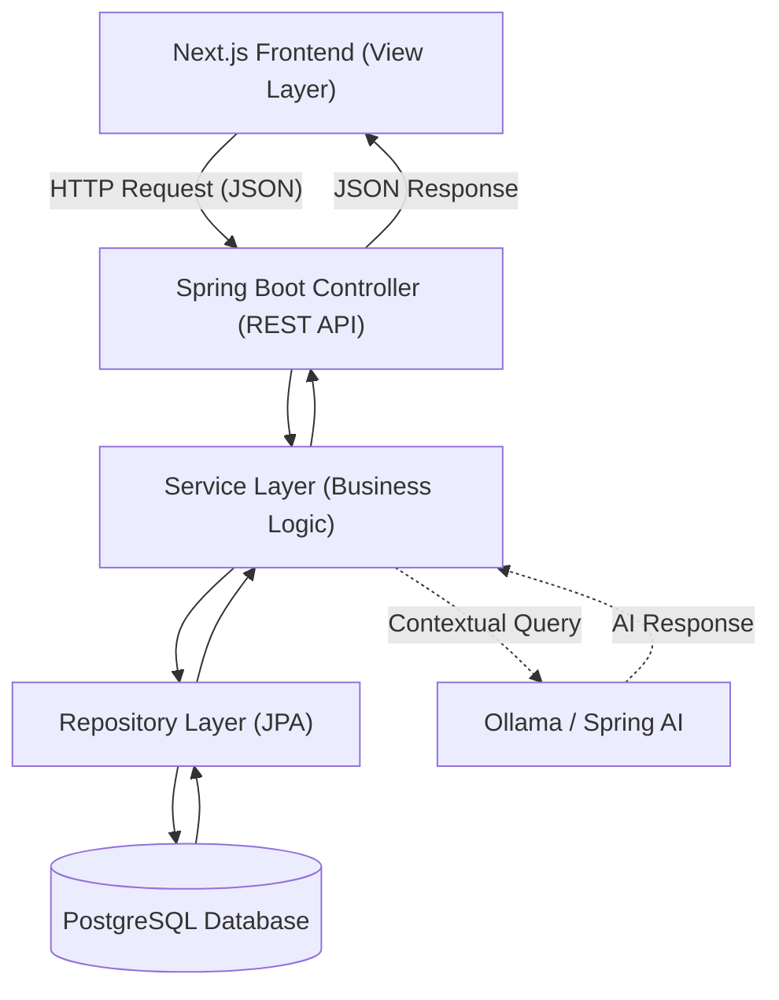

# Smart Digital Hostel Ecosystem 🏨

The **Smart Digital Hostel Ecosystem** is a robust, scalable management platform designed to digitize manual hostel operations. Built for modern student housing like **Shagorika Girls Hostel**, this system enhances transparency, automates financial tracking, and provides real-time administrative oversight.

---

## 🚀 Key Features

### **Student Experience**
* **Digital Complaint Desk:** Register and track maintenance issues (Electrical, Plumbing, etc.) with real-time status updates.
* **Leave Management:** Digital application for leave with instant status tracking for approvals.
* **Smart Mess Services:** View weekly menus and opt for flexible daily or monthly meal plans.
* **Financial Dashboard:** Real-time access to fee structures, payment history, and pending dues.

### **Administration & Warden Tools**
* **Occupancy Monitoring:** Centralized dashboard for real-time room allocation and vacancy tracking.
* **Automated Workflow:** Streamlined approval system for leave requests and complaint resolutions.
* **Fee Management:** Oversee collections and generate automated due lists for the entire hostel.
* **Instant Notifications:** Publish announcements and update mess menus instantly across the platform.

---

## 🤖 Intelligent Query Assistant (AI)

We have integrated a **Private AI Assistant** using **Spring AI** and **Ollama** to provide instant institutional support while ensuring data privacy.

### **AI Tech Stack**
* **LLM Engine:** `gpt-oss` via Ollama for reasoning and answering.
* **Embedding Model:** `nomic-embed-text` for high-accuracy vector representations.
* **Architecture:** Retrieval-Augmented Generation (RAG).

### **Core Capabilities**
* **Scoped Knowledge:** The assistant is strictly bounded to internal hostel documentation, rules, and FAQs.
* **Local Data Privacy:** All processing happens locally through Ollama, ensuring sensitive student data never leaves the infrastructure.
* **Accuracy:** RAG ensures the model retrieves actual hostel policies before answering, preventing hallucinations.

---

## 🏗️ System Architecture (MVC)

**The application follows a clean **MVC (Model-View-Controller)** pattern to ensure scalability and ease of maintenance.



---

## 🛠️ Tech Stack

* **Backend:** Spring Boot (Java) 
* **Frontend:** Next.js (Tailwind CSS, Daisy UI) 
* **AI Integration:** Spring AI & Ollama
* **Database:** PostgreSQL 
* **Tools:** Git, Ubuntu, VS Code 

---

## 📂 Getting Started

### **Prerequisites**
* Java 17+
* Node.js & npm
* Ollama installed and running (`ollama serve`)

### **1. Setup AI Models**
```bash
ollama pull gpt-oss
ollama pull nomic-embed-text
```

### **2. Backend Configuration**
Edit `src/main/resources/application.properties`:
```properties
# Database Config
spring.datasource.url=jdbc:postgresql://localhost:5432/hostel_db
spring.datasource.username=your_username
spring.datasource.password=your_password

# Ollama Config
spring.ai.ollama.base-url=http://localhost:11434
spring.ai.ollama.chat.options.model=gpt-oss
spring.ai.ollama.embedding.options.model=nomic-embed-text
```

---

## 📸 Screenshots

### **1. User Authentication (Signup)**
Testing the backend authentication flow via Postman.
<p align="center">
  
</p>


